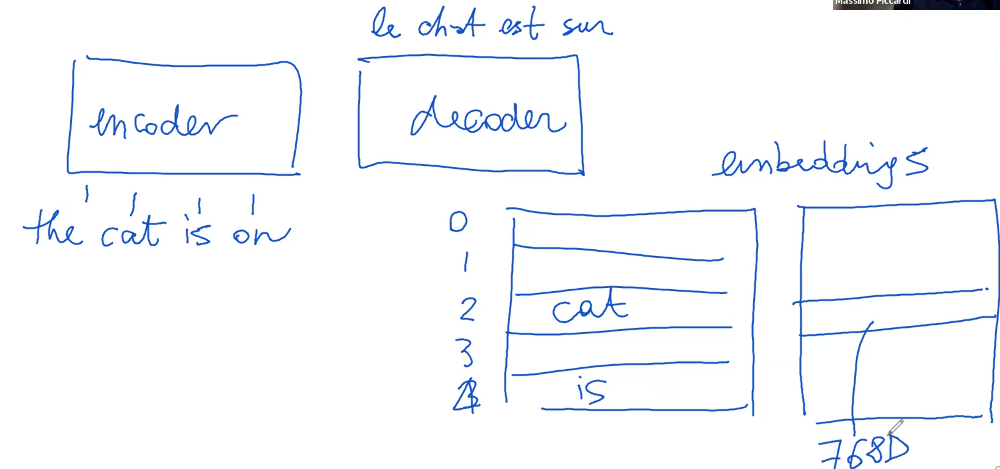
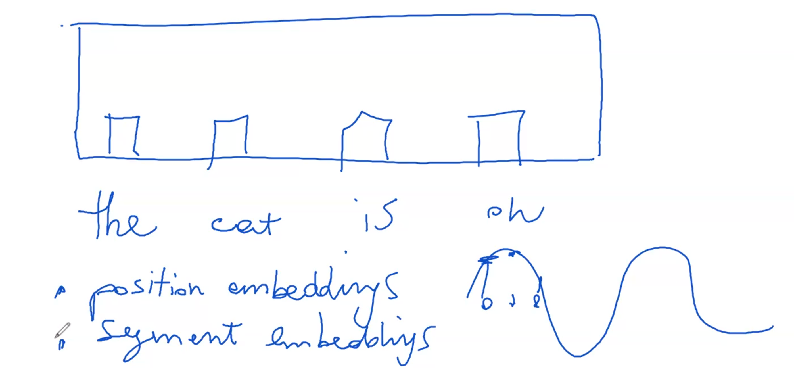
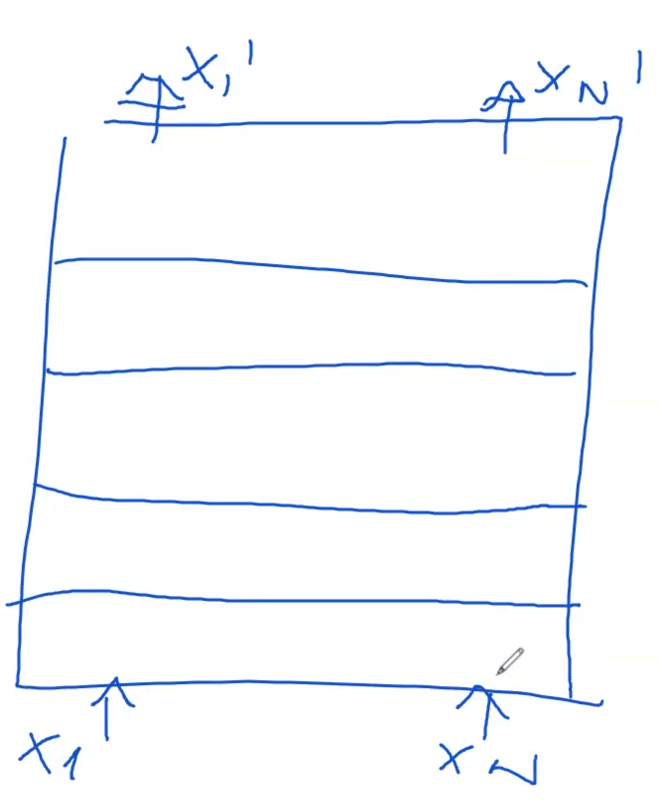
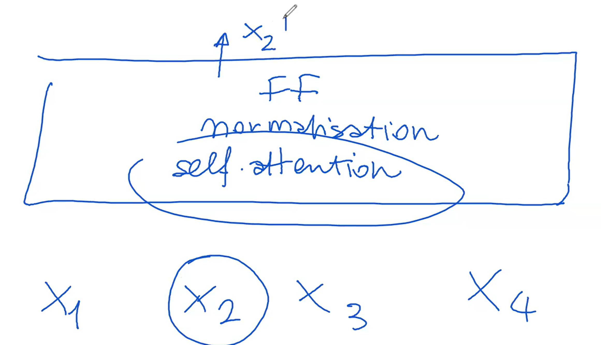
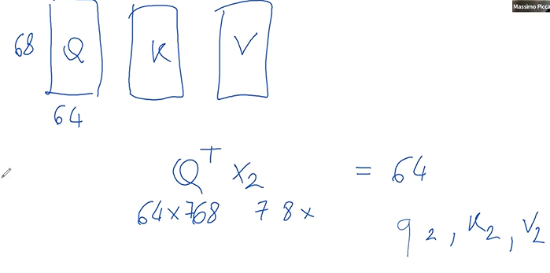
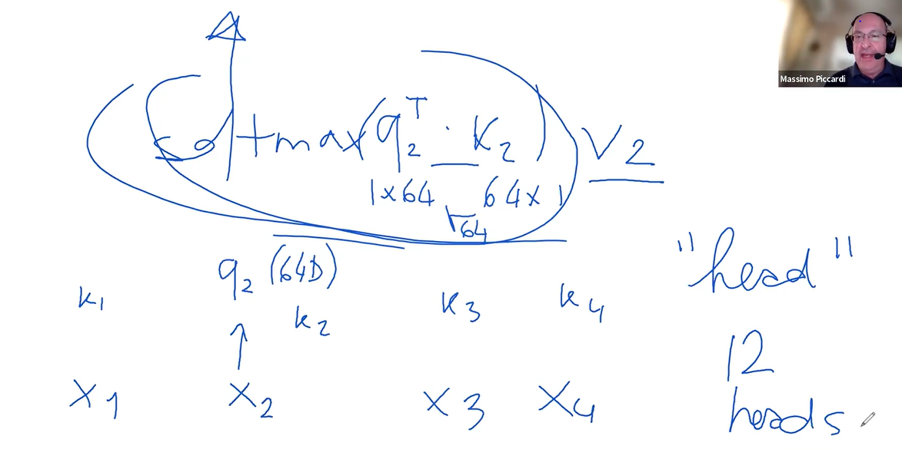
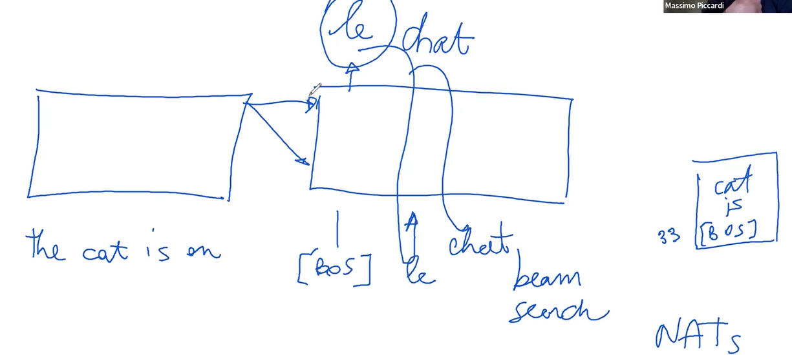
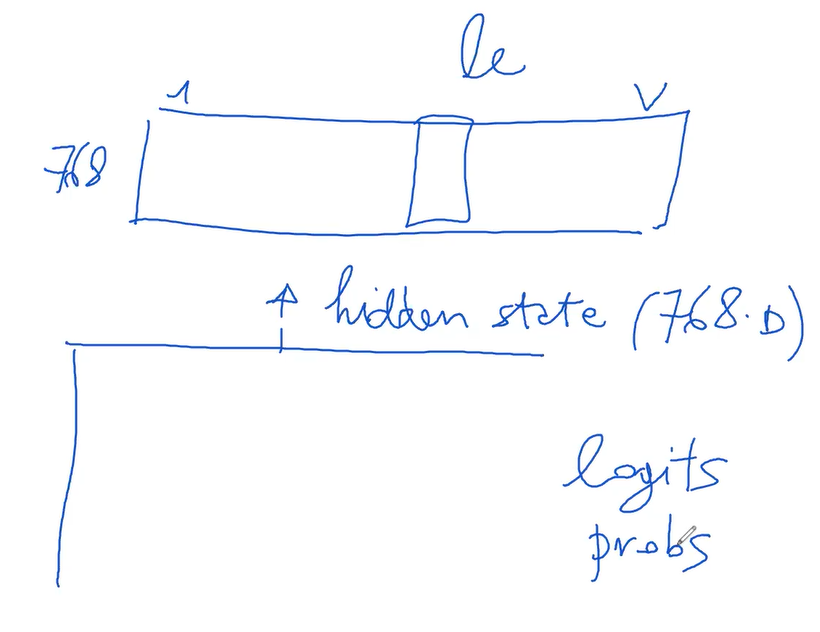
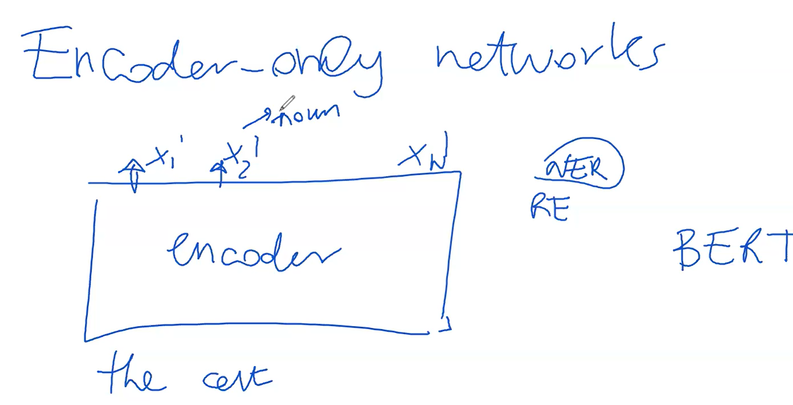
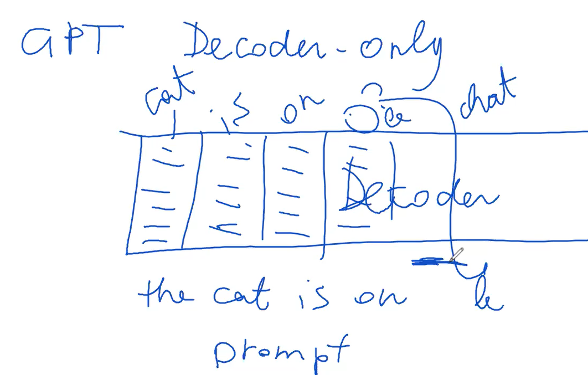

# Transformers_in_a_Nutshell
This repository is a simplified presentation of transformers presented  by Prof Massimo Piccardi

# Table of Content

1. **Transformer Structure**
   - Encoder and Decoder Components
   - Tokenization Process

2. **Token Processing**
   - Linking Tokens to Integer Indices
   - Role of Encoder and Decoder

3. **Embeddings**
   - Numerical Representation of Tokens
   - Significance of Embeddings in Processing

4. **Mechanisms within Transformer**
   - Self-Attention in Encoder
   - Cross-Attention in Decoder

5. **Application in Different Tasks**
   - Translation
   - Text Classification and Named Entity Recognition

6. **Variations of Transformer Models**
   - BERT (Encoder only)
   - GPT (Decoder only) 

# Transformer Structure
 
A transformer network is composed of two distinct yet interconnected parts: an encoder and a decoder. 

## Encoder

The process begins with the encoder receiving text, such as "the cat is on." This text is then divided into smaller components known as tokens, a procedure referred to as tokenization. Tokenization operates based on a specific algorithm tailored to the model or language.

### Token Processing

Consider the phrase "The cat is on." In tokenization, each word becomes a separate token to be processed by the encoder. Initially, these tokens are simply strings of text. If the transformer is employed in a task like translating from English to French, the decoder would then produce a translation, for example, turning "the cat is on" into "le chat est sur."

Diving deeper into the encoding process, we see that the tokens correspond to a transformer's vocabulary. This vocabulary, integral to the transformer, works in conjunction with a tokenizer. It's essentially a comprehensive list that matches words to specific indices, much like pairing words to integer values.

For instance, in a typical setup, a vocabulary might range from 30,000 to as many as 250,000 different tokens. Each word, once tokenized, is linked to an integer index. The original string nature of the token is discarded at this stage, and only the integer index is relevant for further processing.

Attached to this vocabulary are embeddings – pre-calculated numerical vectors that correspond to each token. These embeddings, which can also be randomly initialized, vary in size but are typically within a few hundred dimensions, such as 768. 

So, when the word "cat" appears in the input, it's first converted into an integer index, and then this index is used to retrieve the corresponding embedding from a matrix. These embeddings, essentially large vectors of numbers, are generally small in absolute value and normalized to maintain consistency. 

**Tips:** as the text enters the transformer, it's tokenized, converted into numerical indices, and then these indices are used to extract embeddings, which are then processed by the transformer network.

### Embedding 

This initial transformation is a crucial step in the encoder's processing. What we refer to as token embeddings are the primary inputs into this system. These token embeddings are essentially numerical representations of the tokens and do not rely on their position within the sentence. For example, the embedding for the word "cat" remains constant regardless of its placement in the sentence.

In addition to token embeddings, there are position and segment embeddings. Position embeddings are particularly significant as they add numerical values to the token embeddings, acting like offsets. This addition adjusts the embedding values based on the token's position in the sentence. If the added number is positive, it elevates the embedding values; if negative, it reduces them. A common method for determining these values is using a sinusoidal function, which provides unique, scalable values for each position.

Interestingly, these positional adjustments are sufficient for the encoder to discern the token's placement within a sentence, without explicitly encoding the position. The positional information is implicitly encoded through these slight numerical shifts in the token embeddings.

Segment embeddings, while similar to position embeddings, are less frequently used in practice. They are typically set to zero unless specifically required. Their role becomes prominent in scenarios where the input includes multiple sentences, such as in natural language processing tasks involving sentence comparisons or relationships. Segment embeddings help differentiate between sentences by adjusting the token embeddings of one sentence relative to another.

It's worth noting that an alternative to segment embeddings for differentiating sentences is the use of special separator tokens. However, segment embeddings offer a subtler means of distinguishing between sentences without adding extra tokens.

**Tips:** when these embeddings are input into the encoder – combining token, position, and possibly segment information – they form extended vectors (often 768 dimensions each) that are processed in each token slot of the encoder.

What does the encoder do these embeddings? 

### Mechanisms within Transformer

The encoder's function within the network involves a multi-layered structure, rather than just a single layer. At the outset, there's an initial encoding layer that receives input, which is followed by subsequent layers, each building upon the previous one. In a smaller transformer model, there might be around six layers, while larger models can have up to twelve or more, and this number can be adjusted as needed.

Each layer in the encoder functions similarly. The first layer takes in the embeddings (the numerical representations of tokens) and processes them to produce what are known as hidden states. These hidden states are vectors of the same dimension as the embeddings, often 768 elements.

The hidden states generated by one layer then serve as the input for the next layer. This process continues sequentially through each layer of the encoder. For instance, if we have four tokens represented by embeddings $x1$, $x2$, $x3$, and $x4$, these are transformed into corresponding hidden states at each layer. As the information passes through each layer, the embeddings evolve into hidden states that are processed by subsequent layers.

This repetitive processing across multiple layers culminates in the final hidden states at the last layer of the encoder. These final hidden states represent the fully processed version of the initial embeddings after having been refined through the encoder's multi-layered architecture.

**How each layer works?**

Each layer within the transformer is made up of several smaller networks. The most crucial among these is the self-attention network. Self-attention is a key component often highlighted in research papers and is essential for understanding the transformer's functionality. In addition to self-attention, there are other components like a normalization layer and a feed-forward network.

The architecture of the transformer can vary, with many different versions existing. However, the standard model, which is thoroughly explained in the work of [Jay Alammar] (https://jalammar.github.io/illustrated-transformer/), often serves as a reference point for understanding these concepts. This standard setup includes self-attention, followed by normalization and then feed-forward processing.

While all these components are important, self-attention stands out as the most distinctive feature of the transformer. It's this mechanism that sets the transformer apart from other neural network models. The self-attention network, more than any other part, is what people commonly associate with the unique capabilities of the transformer model.

#### Self-attention

To grasp the concept of self-attention, a useful comparison can be drawn with associative memories.

 Imagine we have four tokens: $x1$, $x2$, $x3$, and $x4$. Each of these tokens, from their initial form to their indexed state and subsequent embeddings, goes through a uniform process in the network.

Let's consider $x2$ as an example. The goal is to process $x2$ in such a way that the output, which we can label as $x2$ prime, differs from the original $x2$. This output is specifically aligned with the second token's slot. The unique aspect of this process is that $x2$' is influenced not only by $x2$ but also by the contributions of all the other tokens – $x1$, $x3$, and $x4$.

The beauty of this system lies in its consistency; the size of $x2'$ remains the same as $x2$. This uniformity allows for the addition of subsequent identical layers atop one another, each repeating the same process. Ultimately, the aim is to produce an output for each token that, while maintaining its original size, is enriched or influenced by the information from all other tokens in the network.

**How does this self-attention works?**

Self-attention within each layer of a transformer involves three critical components: the query matrix $Q$, the key matrix $K$, and the value matrix $V$. These matrices are essential in processing the tokens, for example, token $x2$.

 The matrices, which could be 64 units wide and 768 units tall, interact with the token in a specific way.

When token $x2$ interacts with the query matrix $Q$, it is transformed into a new representation, let's call it $Q2$. This process is replicated with the key matrix $K$ and the value matrix $V$, resulting in key $K2$ and value $V2$ representations for the same token.

The next step involves comparing $Q2$ with the key values of all other tokens, including $x2$ itself. This comparison is done through a dot product, which essentially measures the similarity between $Q2$ and each key. The result of this comparison is a set of values, which can range from high (indicating a strong match) to low or even negative (indicating a weak or no match).

These values are then normalized through a softmax function, turning them into weights that sum up to one. These weights determine the extent to which each token's value $V2$, $V3$, etc., contributes to the final output at that specific position in the sequence.

The final output for each position in the sequence is a weighted sum of all the value vectors, adjusted by these weights. This process effectively allows each position in the encoder to consider all other tokens in the sequence simultaneously, leading to a comprehensive representation that takes into account the entire context of the input sequence.

The self-attention mechanism essentially functions like an associative memory or database. It searches for matches between the query of a specific token and the keys of all other tokens, retrieving values based on these matches. This operation is not a binary match or no match scenario but rather a spectrum of matches represented proportionally.

In a transformer, this self-attention process is not performed just once but multiple times in parallel, each with its set of query $Q$, key $K$, and value $V$ matrices. These multiple iterations, known as heads, allow the model to view the data from different perspectives, each initialized randomly and optimized during the training process through backpropagation. This multiplicity ensures a more robust and nuanced understanding of the input data.

**So what do we do with the output of the 12 heads?**

What happens with the outputs from the 12 heads in the transformer's self-attention mechanism?

The goal is to assemble a vector that matches the original input size. Each of the 12 heads produces a weighted sum of its inputs, forming a 64-dimensional vector. Since there are 12 such heads, the dimensionality calculation can be expressed as:

$$ \text{Dimension per head} \times \text{Number of heads} = 64 \times 12 = 768 $$

Therefore, the outputs from the 12 different heads are concatenated to create a composite vector that mirrors the input's dimensions. This concatenation can be represented as:

$$ \text{Output} = \text{Concatenate}(\text{Head}_1, \text{Head}_2, \ldots, \text{Head}_{12}) $$

This process ensures that the output size is consistent with the input size:

$$ \text{Size}(\text{Output}) = \text{Size}(\text{Input}) $$

By maintaining this dimensionality, it becomes feasible to layer additional encoding layers on top of one another.

The self-attention mechanism, known as multi-headed self-attention, is a critical part of this process. This mechanism can be replicated multiple times, typically 8 to 12 times, depending on the specific dimensions chosen for the embeddings. 

In the given example, with an input of 768 dimensions, each head produces a 64-dimensional output. With 12 heads, the outputs are combined into one unified 768-dimensional vector. This vector, resembling the size of the original input, allows for the stacking of multiple layers within the transformer architecture. 

For now, we'll set aside the details of the normalization and feed-forward networks. The key takeaway is the generation of a hidden state or vector that precisely matches the size of the input, enabling the seamless addition of multiple layers in the transformer.

What happens with the outputs from the 12 heads in the transformer's self-attention mechanism?

The goal is to assemble a vector that matches the original input size. Each of the 12 heads produces a weighted sum of its inputs, forming a 64-dimensional vector. Since there are 12 such heads, multiplying 64 by 12 gives us a 768-dimensional vector. Therefore, the outputs from the 12 different heads are concatenated to create a composite vector that mirrors the input's dimensions.

This process ensures that the output size is consistent with the input size. By maintaining this dimensionality, it becomes feasible to layer additional encoding layers on top of one another. 

The self-attention mechanism, known as multi-headed self-attention, is a critical part of this process. This mechanism can be replicated multiple times, typically 8 to 12 times, depending on the specific dimensions chosen for the embeddings. 

In the given example, with an input of 768 dimensions, each head produces a 64-dimensional output. With 12 heads, the outputs are combined into one unified 768-dimensional vector. This vector, resembling the size of the original input, allows for the stacking of multiple layers within the transformer architecture. 

For now, we'll set aside the details of the normalization and feed-forward networks. The key takeaway is the generation of a hidden state or vector that precisely matches the size of the input, enabling the seamless addition of multiple layers in the transformer.

## Decoder

The encoder functions on the premise, for example, "the cat is on." The decoder's task is to translate this. Structurally, the decoder mirrors the encoder in architecture, maintaining the same network design. However, its operational approach differs significantly.

Unlike the encoder, which operates in parallel, the decoder processes input sequentially, one token at a time. This sequential processing is essential because it's not feasible to generate all output tokens simultaneously.

A notable variation within transformer studies is the non-autoregressive Transformer (NAT), which aims to produce output in one go. The standard decoder, however, starts with the initial token and then sequentially builds the translation.

A special token, often an unusual string not found in regular texts, marks the beginning of a sentence in the decoder's input. This token undergoes the same processing as regular tokens, involving self-attention and layered processing.

At each step, the decoder generates a probability distribution over the vocabulary. The highest probability word is typically selected for the translation – a process known as argmax. For instance, in translating from English to French, the decoder might start by predicting the French word "le."

$$ P(\text{word}) = \text{argmax}_{\text{word}} \, P(\text{word} | \text{context}) $$

The decoder relies on its own predictions for subsequent tokens, necessitating a sequential approach. This process can be refined using techniques like beam search, which explores multiple translation options simultaneously, as opposed to the more linear, greedy decoding.

As the decoder progresses, it aims to correctly predict the following words, using each prediction as the input for the next. This continues until the end of the sentence is reached, often marked by a special end-of-sentence token, signaling the completion of the translation.

The connection between the two networks in a transformer, namely the encoder and the decoder, is facilitated through a mechanism called **cross-attention**, similar in function to self-attention. 

- In the decoder, the query components of the tokens do not only attend to the tokens already processed by the decoder but also to all tokens processed by the encoder.
- This mechanism enriches the hidden states in the decoder with information from both previously translated tokens and all encoder tokens.

The two components of the transformer architecture, the encoder and decoder, are interconnected by a mechanism known as cross-attention, which shares similarities with self-attention. The key distinction here is that within the decoder, the query elements of the tokens not only focus on what has been previously decoded but also consider all the tokens processed by the encoder. This cross-attention mechanism ensures that each token's hidden state in the decoder is informed by both the already translated tokens and the entire sequence of tokens from the encoder.

When discussing functionality, particularly in the decoder, each token is decoded sequentially, producing a probability vector that determines the likelihood of different words. To understand this, let’s consider the decoder's first slot, typically designated for a special token signifying the beginning of a sentence. This slot, much like the entire decoder, mirrors the encoder in structure. It outputs a hidden state with the same dimension, assumed here to be 768.

To convert this 768-dimensional hidden state into a probability distribution over a vocabulary, a matrix of dimensions 768 by the vocabulary size (say 30,000 words) is used. This matrix multiplication generates logits, which are then transformed into probabilities ranging from 0 to 1 through a softmax function. Interestingly, for tasks like word prediction where only the most probable word is required, the direct computation of the argmax from logits suffices, bypassing the need for converting logits into probabilities.

This final matrix in the decoder, interestingly, is similar in structure to the embedding matrix used in the encoder, but functions in reverse. While the encoder transforms words from the vocabulary into 768-dimensional embeddings, the decoder does the opposite, converting 768-dimensional vectors into vocabulary words.

The decoder’s task is intricate, involving the transformation of hidden states into probabilistic predictions of words, influenced by both the previously translated tokens and the original input processed by the encoder. This interaction between the encoder and decoder, facilitated by the cross-attention mechanism, is a defining feature of the transformer model, enabling it to effectively handle complex language processing tasks.

### Encoder-Only

Transformers can be implemented with just an encoder network, excluding the decoder. This approach, focused solely on the encoder, is particularly effective and widely recognized.

Regarding the encoder-only network, it's essentially half of a typical transformer model, focusing solely on the encoding aspect. This encoder-only setup, renowned for its effectiveness, is the backbone of many significant applications. Unlike configurations that involve both an encoder and a decoder, this approach hinges exclusively on the encoder.

The encoder is utilized in a manner similar to standard transformers, processing input such as a sentence and converting it into a series of final vectors or hidden states, denoted as $$X'_1, X'_2, \ldots, X'_n$$, each corresponding to the dimensions of 768. However, unlike transformers aimed at tasks like translation or sentence generation, the encoder-only model is geared towards tasks that require labeling or classifying individual tokens in the input. For instance, in named entity recognition or relation extraction tasks, the goal is to assign specific class labels to each word or token, not to generate new text.

In practice, this involves transforming the final layer hidden states of size 768 into a smaller set of class labels, such as 10, if the task involves categorizing each word into one of 10 classes. This transformation is executed through a final matrix that maps the 768-dimensional vectors to a smaller number of class probabilities. Thus, the model's output becomes a sequence of class labels rather than words.

Moreover, this encoder-only framework is also applied in text classification tasks like sentiment analysis. Here, instead of assigning labels to each token, the entire text is classified into one of several categories. The process involves taking the output of one particular token, often influenced by all others through the encoding process, and converting its 768-dimensional vector into a probability vector over the class set (e.g., positive, negative, neutral). This is typically done using a matrix that reduces the 768 dimensions to match the number of classes.

To further refine the process and avoid biases towards any specific token, BERT and similar models introduce a special token at the beginning of the input sequence. This token, often referred to as the CLS token, is specifically used for classification tasks, ensuring that the probabilities it generates are influenced equally by all tokens in the sentence.

### Decoder-Only (eg.gpt)

GPT stands as a key transformer model, characterized by its exclusive reliance on decoders. Unlike typical transformers that include encoders, GPT's architecture is centered around an extensive decoder section. Inputs, such as "The cat is on the mat," are fed directly into the decoder as initial tokens, bypassing the encoder.

In GPT's framework, output generation unfolds sequentially, token by token. This method might appear contrary to earlier explanations regarding sequential output generation, which is contingent on previously generated outputs. However, GPT can predetermine certain inputs and outputs via a supervised method, enabling more controlled token generation.

The model utilizes prompts as initial token sequences, guiding the decoder to generate subsequent sequences. Post prompt completion, the decoder independently predicts the remaining sequence, basing each next token prediction on existing probability distributions.

Training GPT involves a supervised approach. In translation tasks, for instance, the model is trained to accurately predict the next token in a sequence, taking into account both the previously translated tokens and the initial input. The primary goal during training is to enhance the probability of correctly translating each sequential step, often employing methods like cross-entropy or negative log likelihood.

During the decoding phase, GPT generates a probability vector at each step. From this vector, the model selects the token with the highest probability, which then informs the prediction for the next token.

In mathematical terms, the training objective in GPT, particularly for translation tasks, is often represented as maximizing the probability of the correct token $ y_t $ at each step $ t $ in the decoder, given all previously translated tokens $y_{1:t-1} $ and the entire input sequence $$ x_{1:t} $$. This is expressed as maximizing $$ P(y_t | y_{1:t-1}, x_{1:t}) $$. In practice, this maximization is done using the log likelihood, which is summed over the entire output sequence. The negative of this log likelihood, known as the negative log likelihood or cross entropy, is minimized during training.

GPT's decoder-centric design paves the way for a broad spectrum of applications, particularly in sequential text generation, underpinned by an effective, supervised training methodology.